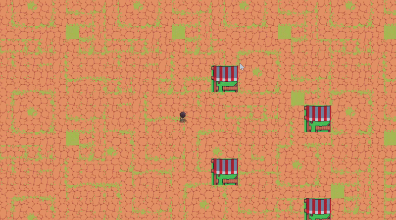

# Adventure Minigame

A 2D adventure game built with **Python**, **Pygame-CE**, and **PyTMX**. This project is currently under development and serves as both a learning project and a foundation for creating a complete top-down adventure game.
<p align="center">
  
</p>

## Current Features

- Player movement (W, A, S, D)
- Camera system that follows the player
- Animated player character
  - Idle animation
  - Walking animation
- Tilemap rendering using **Tiled Map Editor**
- World loading with **PyTMX**

## Features in Progress

- Animated tiles
- Collision system
- NPCs
- Interaction system
- Inventory system
- Quest system
- Save & Load system
- Sound effects
- Background music

---

## Built With

- Python 3.13
- Pygame-CE
- PyTMX
- Tiled Map Editor

---

## Installation

### Clone the repository

```bash
git clone https://github.com/your-username/Adventure_minigame.git
```

### Navigate to the project folder

```bash
cd Adventure_minigame
```

### Create a virtual environment

```bash
python -m venv .venv
```

### Activate the virtual environment

**Windows (PowerShell)**

```powershell
.venv\Scripts\Activate.ps1
```

**Windows (Command Prompt)**

```cmd
.venv\Scripts\activate.bat
```

### Install dependencies

```bash
pip install -r requirements.txt
```

### Run the game

```bash
python main.py
```

---

## Controls

| Key | Action |
|-----|--------|
| W | Move Up |
| A | Move Left |
| S | Move Down |
| D | Move Right |

---

## Development Progress

Current implementation includes:

- ✅ Smooth player movement
- ✅ Camera following the player
- ✅ Idle and walking animations
- ✅ Tilemap rendering using Tiled (.tmx)

The following features are currently under development:

- Animated map tiles
- Collision detection
- NPC interactions
- Inventory and quest systems

---

## Roadmap

- [x] Player Movement
- [x] Camera System
- [x] Sprite Animation
- [x] Tilemap Rendering
- [ ] Animated Tiles
- [ ] Collision System
- [ ] NPCs
- [ ] Interaction System
- [ ] Inventory System
- [ ] Quest System
- [ ] Save & Load
- [ ] Sound Effects
- [ ] Background Music

---

## License

This project is intended for educational purposes and personal game development practice.

---

## Author

Developed by **Fachrezza**

GitHub: https://github.com/fachrezza